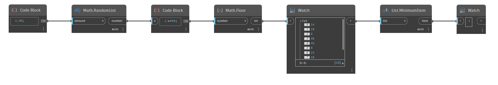

## En detalle:
`List.MinimumItem` realiza una búsqueda en una lista de valores y devuelve el elemento con el valor mínimo.

En el ejemplo siguiente, se genera una lista de 10 números aleatorios entre 0 y 49. A continuación, se utiliza un nodo `List.MinimumItem` para buscar el menor elemento de la lista.
___
## Archivo de ejemplo

