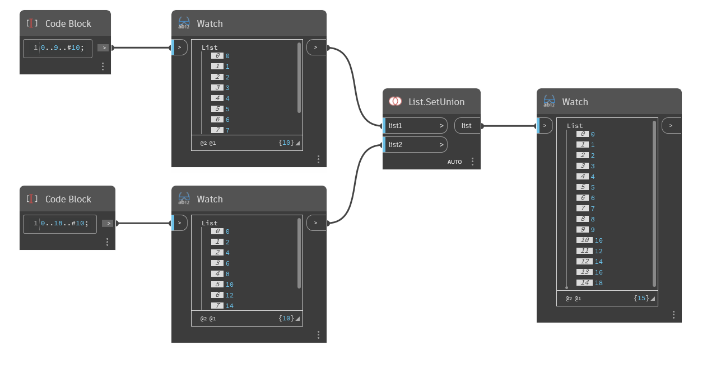

## En detalle:
`List.SetUnion` devuelve una nueva lista mediante la combinación de los objetos de dos listas de entrada y la eliminación de los valores duplicados.

En el ejemplo siguiente, una lista de 0 a 9, escalonada en 1, se combina con una lista de 0 a 18, escalonada en 2. La lista resultante contiene todos los elementos de "List1" y "List2" con los duplicados (0, 2, 4, etc.) eliminados.
___
## Archivo de ejemplo

