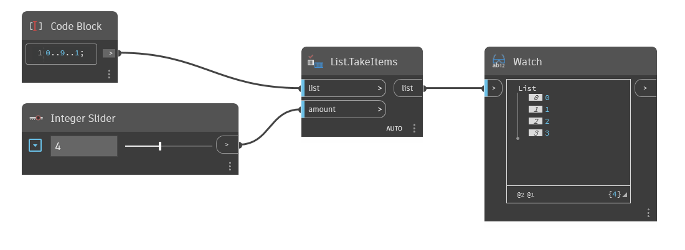

## En detalle:
`List.TakeItems` devuelve el número especificado de elementos desde el principio de la lista de entrada. Si la entrada `amount` es negativa, los elementos se obtienen del final de la lista en orden inverso.

En el ejemplo siguiente, empezamos con un rango de números de 0 a 9, escalonado en 1. Utilizamos un control deslizante de entero para la entrada `amount` a fin de especificar el número de elementos de la lista original que se van a utilizar. Con una entrada de 4, la lista de salida contiene los primeros cuatro elementos de la lista original.
___
## Archivo de ejemplo

