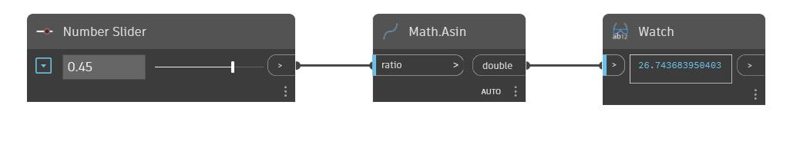

## En detalle:
Asin devolverá el seno inverso, también conocido como arcoseno, de un número de entrada entre -1 y 1. Este ángulo de salida se devuelve en grados. En el siguiente ejemplo, se utiliza un control deslizante de número establecido en el rango de -1 a 1 para ajustar la entrada en un nodo Asin.
___
## Archivo de ejemplo

