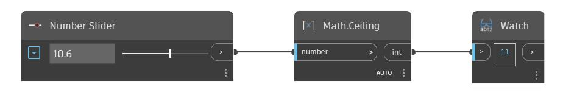

## En detalle:
Ceiling buscará el entero más cercano que sea mayor a un número de entrada. Esto también se puede considerar como redondeo hacia arriba al entero más cercano. En el siguiente ejemplo, se utiliza un control deslizante de número para ajustar la entrada en un nodo Ceiling.
___
## Archivo de ejemplo

