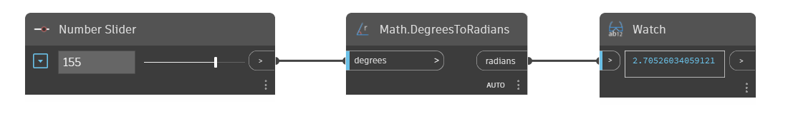

## En detalle:
`Math.DegreesToRadians` convierte un ángulo de entrada de grados a radianes.

En el ejemplo siguiente, utilizamos un control deslizante de número ajustado al rango de -360 a 360 para modificar el ángulo de entrada en un nodo `Math.DegreesToRadians`.
___
## Archivo de ejemplo

