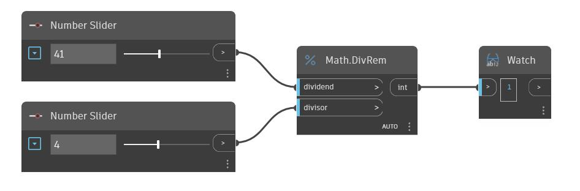

## En detalle:
DivRem devolverá el resto de un número de entrada después de dividirlo por un divisor especificado. Esto también se conoce como módulo y es equivalente al operador "%". En el siguiente ejemplo, se utilizan dos controles deslizantes de número para establecer el dividendo y el divisor de un nodo DivRem.
___
## Archivo de ejemplo

