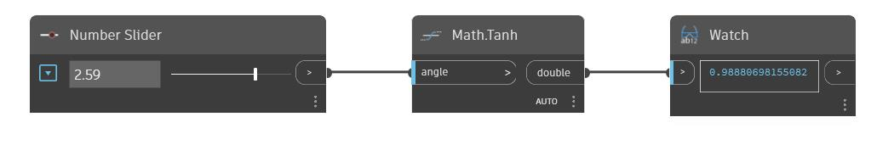

## En detalle:
Tanh devolverá la tangente hiperbólica de un ángulo de entrada en radianes. En el siguiente ejemplo, se utiliza un control deslizante de número establecido en el rango de -6.28 a 6.28 para controlar el ángulo de entrada en un nodo Tanh.
___
## Archivo de ejemplo

