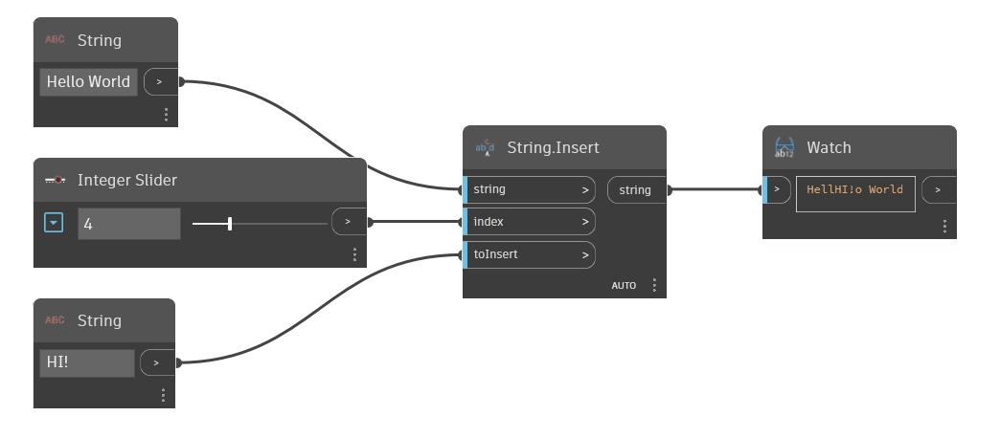

## En detalle:
Insert insertará una cadena determinada en una cadena base en un índice especificado. En el siguiente ejemplo, se comienza con la cadena base "Hello World". Se utiliza una segunda cadena "Hi!" como cadena de inserción. Se usa un control deslizante de entero para ajustar el índice en el que se insertará la segunda cadena en la cadena base.
___
## Archivo de ejemplo

