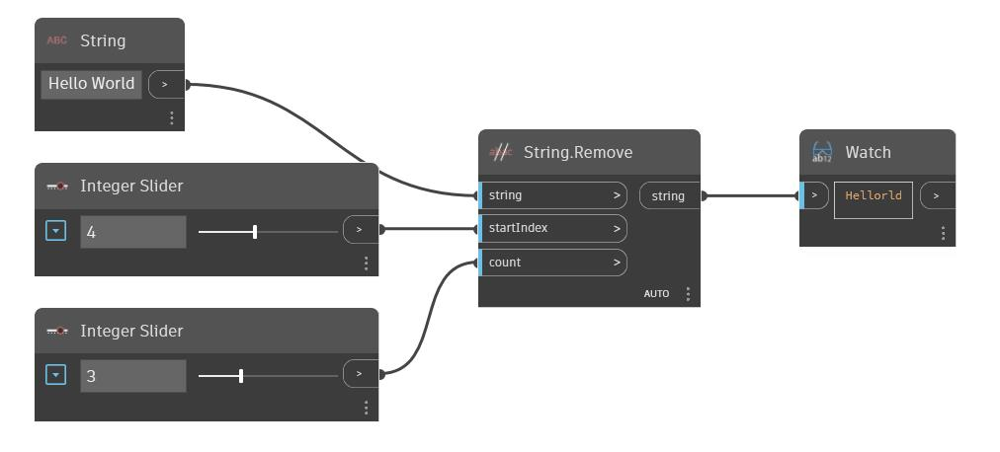

## En detalle:
Remove utiliza una cadena como entrada y elimina caracteres de ella empezando por la entrada startIndex. El número de caracteres que se va a eliminar se especifica mediante el índice count. En el siguiente ejemplo, se comienza con la cadena "Hello World". Se utilizan dos controles deslizantes de entero para ajustar el startIndex y el recuento de caracteres que se van a eliminar mediante un nodo Remove.
___
## Archivo de ejemplo

