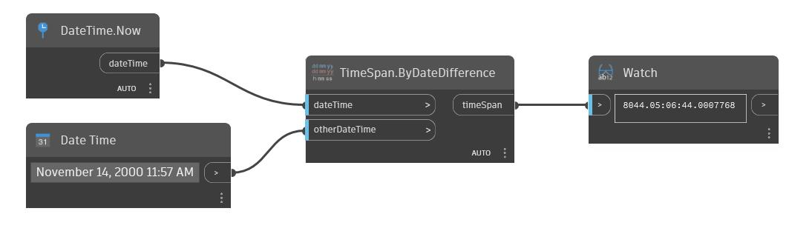

## En detalle:
ByDateDifference devolverá la diferencia de dos DateTime como un nuevo TimeSpan. En el siguiente ejemplo, la diferencia entre el momento actual y el 14 de noviembre de 2000 a las 11:57 a.m. es de 5844 días y aproximadamente 4 segundos.
___
## Archivo de ejemplo

