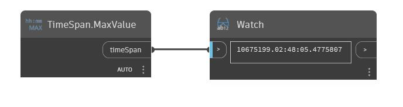

## En detalle:
MaxValue devolverá el valor máximo que puede tener un TimeSpan. En el siguiente ejemplo, se devuelve un TimeSpan de 10.675.199 días, 2 horas, 28 minutos, 5 segundos, y 477 milisegundos.
___
## Archivo de ejemplo

