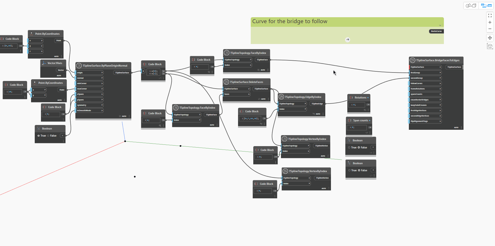

<!--- Autodesk.DesignScript.Geometry.TSpline.TSplineSurface.BridgeFacesToEdges --->
<!--- DVNDD4ZUEDM4QCH35SLRIEZJLS266CIRRB7MZMMNDBI5W6UPBSQA --->
## En detalle:
`TSplineSurface.BridgeToFacesToEdges` conecta un conjunto de aristas con un conjunto de caras, ya sean de la misma superficie o de dos diferentes. Las aristas que forman las caras tienen que coincidir en número o ser múltiplos de las aristas del otro lado del puente. El nodo requiere las entradas que se describen a continuación. Las tres primeras entradas son suficientes para generar el puente; el resto son opcionales. La superficie resultante procede de la superficie a la que pertenece el primer grupo de aristas.

- `TSplineSurface`: la superficie que se va a conectar.
- `firstGroup`: las caras de la TSplineSurface seleccionada.
- `secondGroup`: las aristas de la misma superficie de T-Spline seleccionada o de otra distinta. El número de aristas debe coincidir exactamente o ser múltiplo del número de aristas del otro lado del puente.
- `followCurves`: (opcional) una curva para que el puente la siga. En ausencia de esta entrada, el puente sigue una línea recta.
- `frameRotations`: (opcional) el número de rotaciones de la extrusión del puente que conecta las aristas seleccionadas.
- `spansCounts`: (opcional) el número de tramos/segmentos de la extrusión del puente que conecta las aristas elegidas. Si el número de tramos es demasiado bajo, es posible que determinadas opciones no estén disponibles hasta que se aumente.
- `cleanBorderBridges`: (opcional) suprime los puentes entre los puentes de borde para evitar pliegues.
- `keepSubdCreases`: (opcional) conserva los pliegues subdivididos de la topología de entrada, lo que da como resultado un tratamiento plegado del inicio y el final del puente.
- `firstAlignVertices`(opcional) y `secondAlignVertices`: imponen la alineación entre dos conjuntos de vértices en lugar de elegir automáticamente la conexión de los pares de vértices más cercanos.
- `flipAlignFlags`: (opcional) invierte la dirección de los vértices que se van a alinear.

En el ejemplo siguiente, se crean dos planos de T-Spline y se recopilan conjuntos de aristas y caras mediante los nodos `TSplineTopology.VertexByIndex` y `TSplineTopology.FaceByIndex`. Para crear un puente, las caras y las aristas se utilizan como entrada para el nodo `TSplineSurface.BrideFacesToEdges`, junto con una de las superficies. De este modo, se crea el puente. Se añaden más tramos al puente mediante la edición de la entrada `spansCounts`. Cuando se utiliza una curva como entrada para `followCurves`, el puente sigue la dirección de la curva indicada. Las entradas `keepSubdCreases`, `frameRotations`, `firstAlignVertices` y `secondAlignVertices` muestran cómo puede ajustarse la forma del puente.

## Archivo de ejemplo

