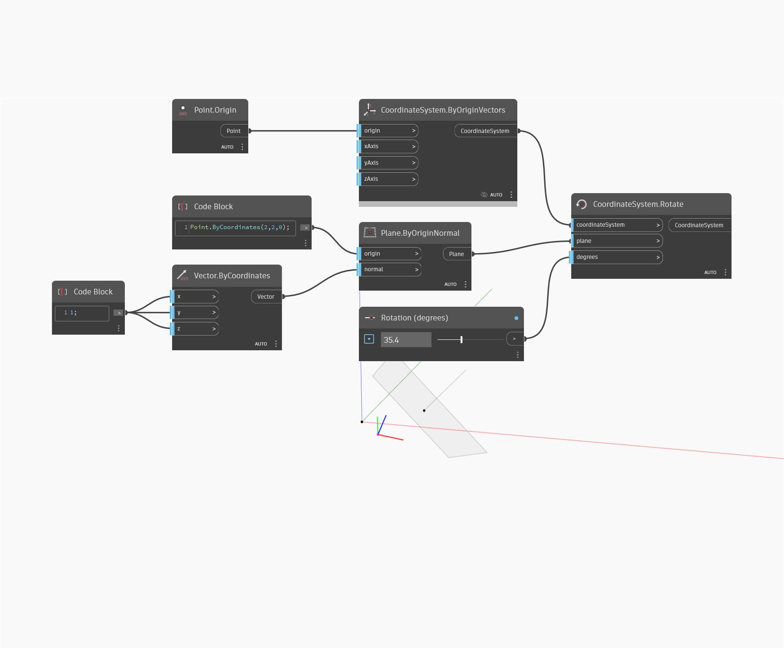

<!--- Autodesk.DesignScript.Geometry.CoordinateSystem.Rotate(plane, degrees) --->
<!--- EFSMOCLY4VKHHCT3366EWQTFWSXBTMVTLKT2H53S3PZFKGNNWXNQ --->
## En detalle:
Gira un sistema de coordenadas en un plano según un grado especificado.
___
## Archivo de ejemplo

