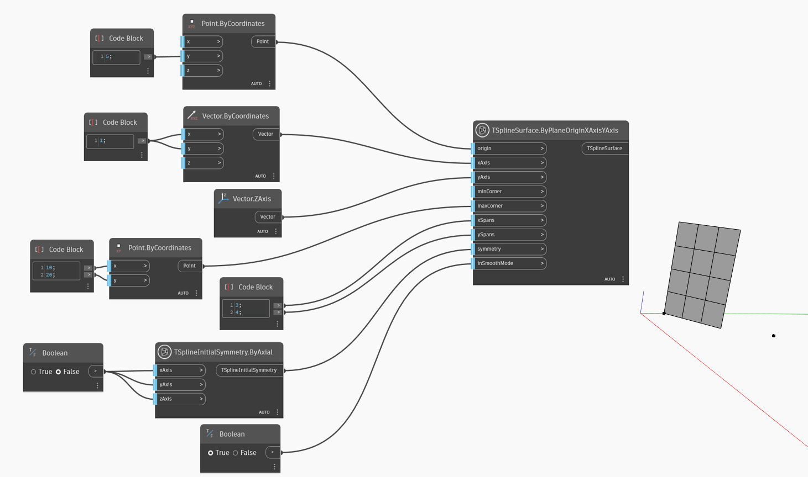

<!--- Autodesk.DesignScript.Geometry.TSpline.TSplineSurface.ByPlaneOriginXAxisYAxis --->
<!--- JDRXXB3ZLF7RXZJRV66VKV5ZDAZGN5YCY7ZLVWABJQNDVHNU4QKA --->
## In-Depth
`TSplineSurface.ByPlaneOriginXAxisYAxis` genera una superficie de plano de primitiva de T-Spline mediante un punto de origen y dos vectores que representan los ejes X e Y del plano. Para crear el plano de T-Spline, el nodo utiliza las siguientes entradas:
- `origin`: a point defining the origin of the plane.
- `xAxis` y `yAxis`: vectores que definen la dirección de los ejes X e Y del plano creado.
- `minCorner` and `maxCorner`: the corners of the plane, represented as Points with X and Y values (Z coordinates will be ignored). These corners represent the extents of the output T-Spline surface if it is translated onto the XY plane. The `minCorner` and `maxCorner` points do not have to coincide with the corner vertices in 3D. For example, when a `minCorner` is set to (0,0) and `maxCorner` is (5,10), the plane width and length will be 5 and 10 respectively.
- `xSpans` and `ySpans`: number of width and length spans/divisions of the plane
- `symmetry`: whether the geometry is symmetrical with respect to its X, Y and Z axes
- `inSmoothMode`: whether the resulting geometry will appear with smooth or box mode

En el ejemplo siguiente, se crea una superficie plana de T-Spline mediante el punto de origen especificado y dos vectores que actúan como direcciones X e Y. El tamaño de la superficie se controla mediante los dos puntos utilizados como entradas `minCorner` y `maxCorner`.

## Archivo de ejemplo

