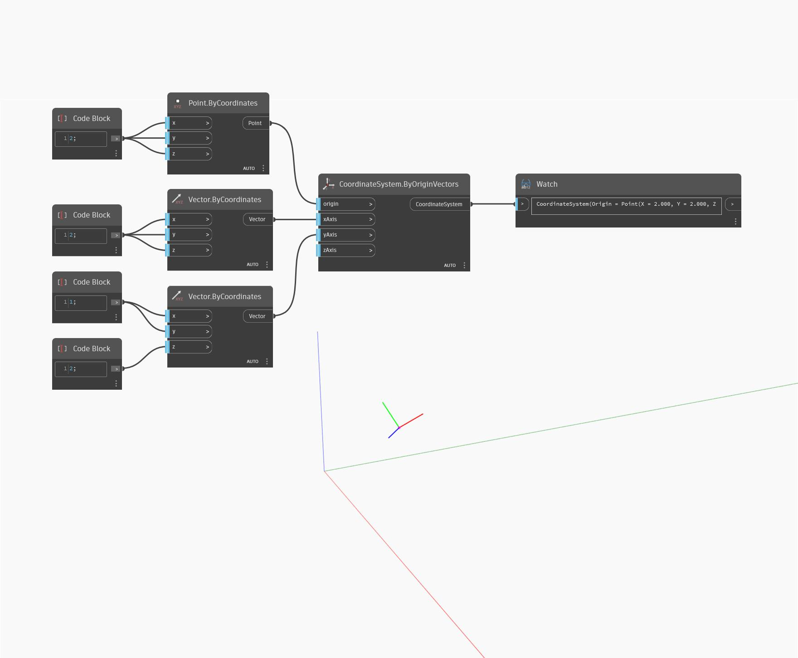

<!--- Autodesk.DesignScript.Geometry.CoordinateSystem.ByOriginVectors(origin, xAxis, yAxis, zAxis) --->
<!--- KLFVJ5DI7APVNODARMSE3JM5C27DG62OXUUQRS3HCDTZYO6IBOZA --->
## En detalle:
`CoordinateSystem.ByOriginVectors (origin, xAxis, yAxis, zAxis)` devuelve un nuevo CoordinateSystem en un punto de origen de entrada con los ejes X, Y y Z de entrada.

En el ejemplo siguiente, el CoordinateSystem se coloca en un origen con vectores nuevos para los ejes X, Y y Z. El resultado es un CoordinateSystem girado relativo al CoordinateSystem original.

___
## Archivo de ejemplo

