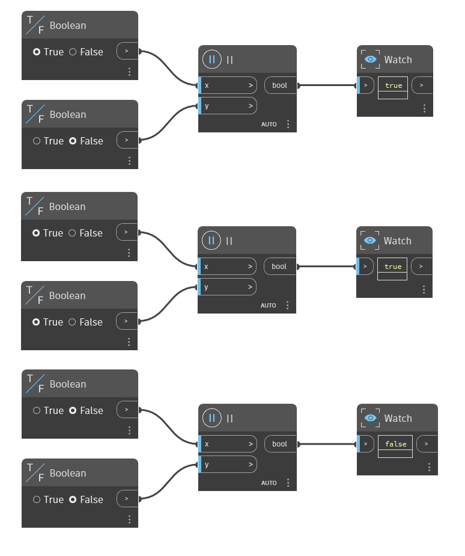

## En detalle:
El nodo `||` es el operador "O". Toma dos valores booleanos como entradas y devuelve "True" (verdadero) si uno o ambos valores son "True" (verdadero). Si ambos valores son "False" (falso), devuelve "False" (falso). En el ejemplo siguiente, se usan tres nodos `|||` para determinar si al menos uno de los valores boleanos de entrada es "True" (verdadero). El primer nodo tiene una entrada "True" (verdadero) y "False" (falso), por lo que devuelve "True" (verdadero). El segundo nodo tiene dos entradas "True" (verdadero), por lo que devuelve "True" (verdadero). El tercer nodo tiene dos entradas "False" (falso), por lo que devuelve "False" (falso).
___
## Archivo de ejemplo

