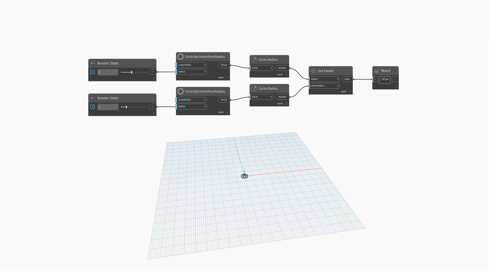

## En detalle:
`List.Equals` devuelve el valor booleano "True" (verdadero) si ambos objetos de entrada son iguales.

En el ejemplo siguiente, se comparan los radios (dobles) de dos círculos. Si los controles deslizantes de número presentan valores diferentes, `List.Equals` devuelve "False" (falso). Si ambos valores son iguales, `List.Equals` devuelve "True" (verdadero).
___
## Archivo de ejemplo

