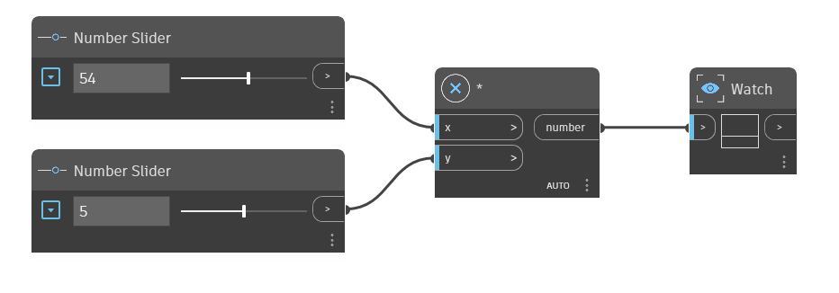

## En detalle:
El nodo `*` es el operador de multiplicación. Devuelve el producto de los dos números de entrada. En el siguiente ejemplo, se utiliza un nodo `*` para multiplicar x por y. Se utilizan dos controles deslizantes de número para gestionar las entradas del operador `*`.
___
## Archivo de ejemplo

