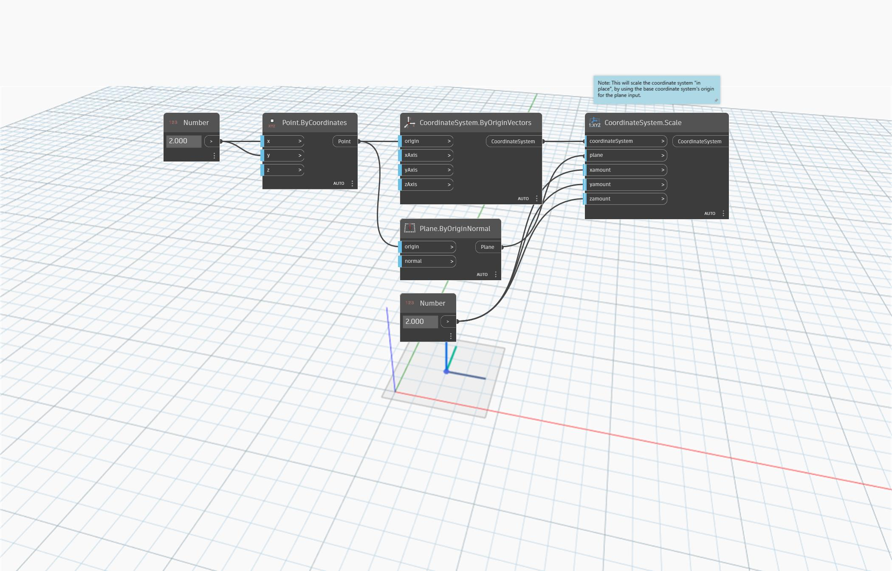

<!--- Autodesk.DesignScript.Geometry.CoordinateSystem.Scale(coordinateSystem, plane, xamount, yamount, zamount) --->
<!--- NE2FY5VUCEZ5FDNQJAZD74HKN3WQSOQJXNOQ77SK3PFIJQCTF23Q --->
## En detalle:
`CoordinateSystem.Scale (coordinateSystem, plane, xamount, yamount, zamount)` ajusta la escala de un sistema de coordenadas de modo no uniforme alrededor de un plano especificado. La escala del sistema de coordenadas se ajusta mediante la utilización del origen del sistema de coordenadas base para la entrada de plano.
___
## Archivo de ejemplo

