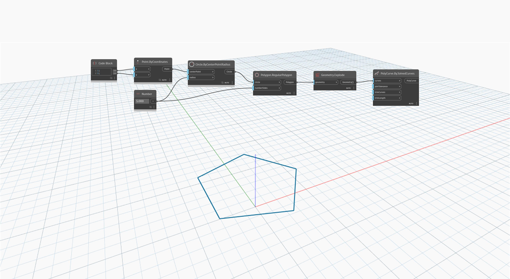

<!--- Autodesk.DesignScript.Geometry.PolyCurve.ByJoinedCurves(curves, joinTolerance, trimCurves, trimLength) --->
<!--- NHC5UY7UTB4NA5X3EXEIVOE3EOF7CFAXOVVAHYJ7ZSKC76OLPPYA --->
## En detalle:
`PolyCurve.ByJoinedCurves` crea curvas unidas a partir de un conjunto de curvas con vértices coincidentes. Puede determinar el tamaño permisible del hueco entre curvas que se unirán con la entrada `joinTolerance`.

En el ejemplo siguiente, se descompone un elemento `Polygon.RegularPolygon` en una lista de curvas y, a continuación, se vuelve a unir en una PolyCurve.
___
## Archivo de ejemplo

