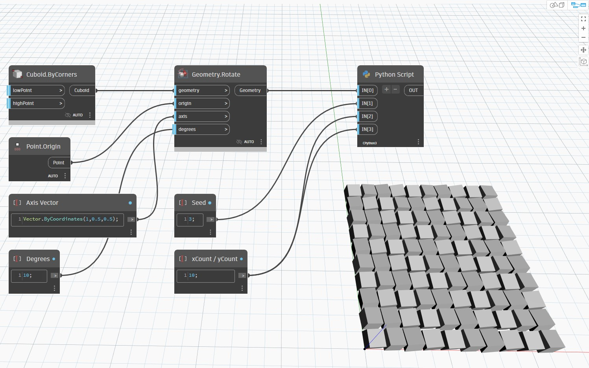

## En detalle:
Python Script will return the result of the node's inputs passed through an embedded python script. In the example below, a cube created from Cuboid.ByCorners is arrayed and translated by a Python script that loops through both X and Y. Double clicking the node will bring up an editor for the script.
___
## Archivo de ejemplo

