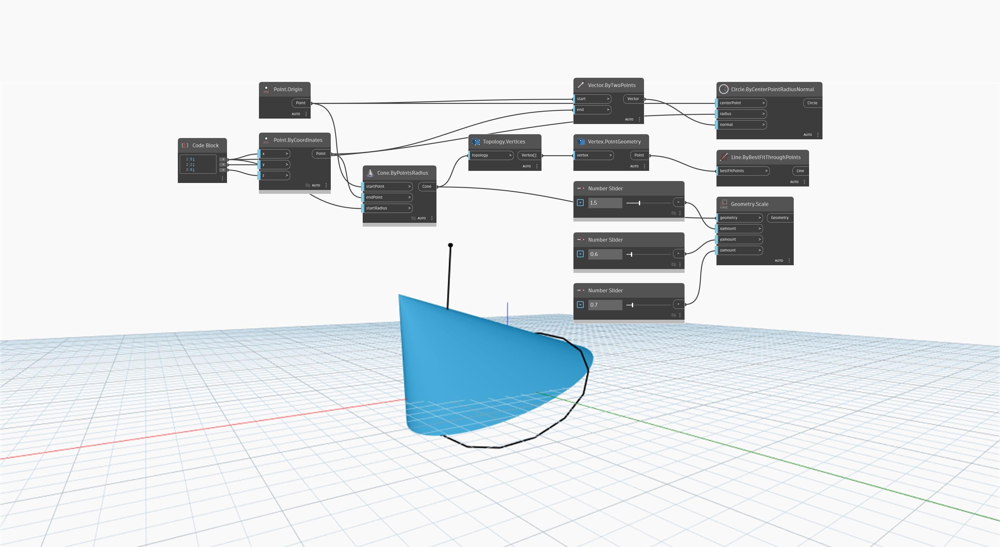

<!--- Autodesk.DesignScript.Geometry.Geometry.Scale(geometry, xamount, yamount, zamount) --->
<!--- SJMZSTNGGMBIKKM3WNMNAKWFRS7HQPJRSJNIZIC755BAXDNI6GJA --->
## En detalle:
`Geometry.Scale (xamount, yamount, zamount)` ajusta la escala de una geometría de entrada del centroide del objeto mediante un factor de entrada.

En el ejemplo siguiente, la escala de un cono se puede ajustar con precisión con tres controles deslizantes de número. Los bordes del cono original se dibujan como referencia visual.
___
## Archivo de ejemplo

