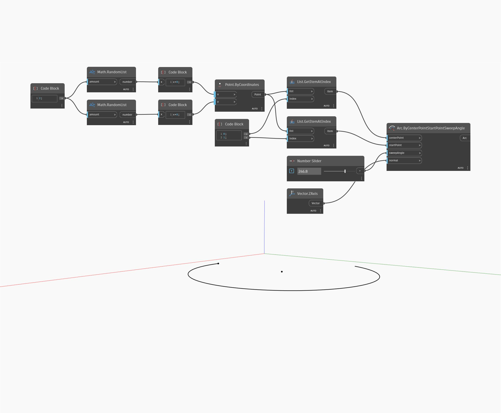

<!--- Autodesk.DesignScript.Geometry.Arc.ByCenterPointStartPointSweepAngle --->
<!--- T4ELVGYIGJW62SQ52OSQTHK7FD4HPDADDXLQ3W54SUACRRXKXZGQ --->
## En detalle:
Arc.ByCenterPointStartPointSweepAngle crea un arco alrededor de un centro con un ángulo de barrido especificado. El punto inicial indica a Dynamo dónde comenzar a dibujar el arco. En este ejemplo, se dibuja un arco alrededor de un punto generado aleatoriamente.
___
## Archivo de ejemplo

