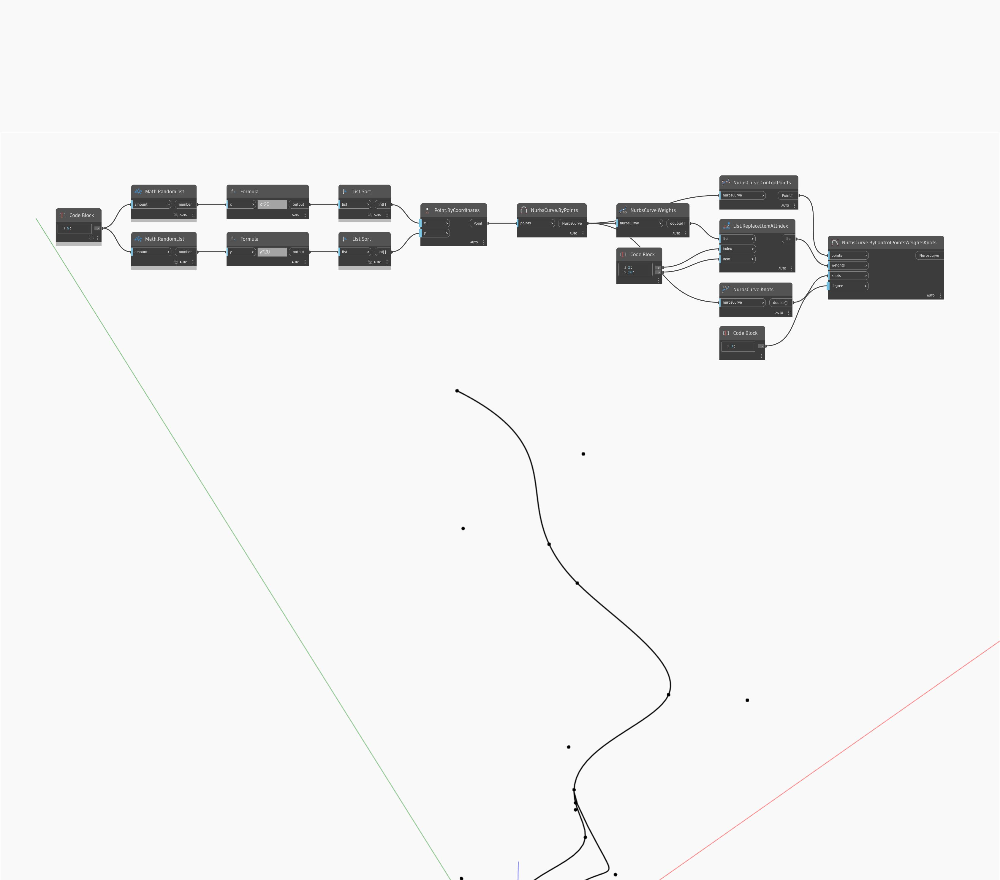

<!--- Autodesk.DesignScript.Geometry.NurbsCurve.ByControlPointsWeightsKnots --->
<!--- T6GEU2COB3ZCMHPIT6WYQEY7NOLFALMOFIPSGLNKU5GNGESBEB7Q --->
## En detalle:
`NurbsCurve.ByControlPointsWeightsKnots` permite controlar manualmente los grosores y los nudos de una NurbsCurve. La lista de grosores debe tener la misma longitud que la lista de puntos de control. El tamaño de la lista de nudos debe ser igual al número de puntos de control más el grado más 1.

En el ejemplo siguiente, creamos primero una NurbsCurve mediante la interpolación entre una serie de puntos aleatorios. Utilizamos nudos, grosores y puntos de control para buscar las partes correspondientes de esa curva. Podemos utilizar `List.ReplaceItemAtIndex` para modificar la lista de grosores. Por último, utilizamos `NurbsCurve.ByControlPointsWeightsKnots` para volver a crear una NurbsCurve con los grosores modificados.

___
## Archivo de ejemplo

