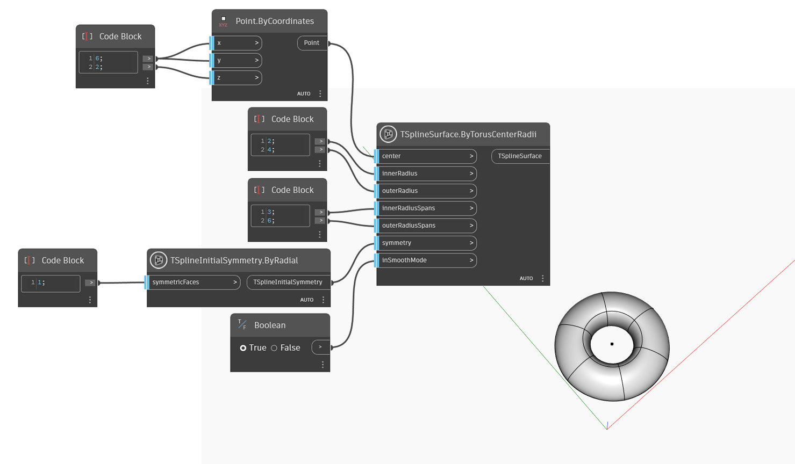

<!--- Autodesk.DesignScript.Geometry.TSpline.TSplineSurface.ByTorusCenterRadii --->
<!--- TAX4CBLVHC7JXO4PNOKK44X5VVCC377TK4Q3R5UBTYQROUPG4VCQ --->
## In-Depth
En el ejemplo siguiente, se crea una superficie de toroide de T-Spline en torno a un centro especificado. Los radios menor y mayor de la forma se establecen mediante las entradas `innerRadius` y `outerRadius`. Los valores de `innerRadiusSpans` y `outerRadiusSpans` controlan la definición de la superficie a lo largo de las dos direcciones. La simetría inicial de la forma se especifica mediante la entrada `symmetry`. Si la simetría axial aplicada a la forma está activa para el eje X o Y, el valor de `outerRadiusSpans` del toroide debe ser un múltiplo de 4. La simetría radial no presenta este requisito. Por último, la entrada `inSmoothMode` se utiliza para alternar entre la vista preliminar en modo de cuadro y suavizado de la superficie de T-Spline.

## Archivo de ejemplo

