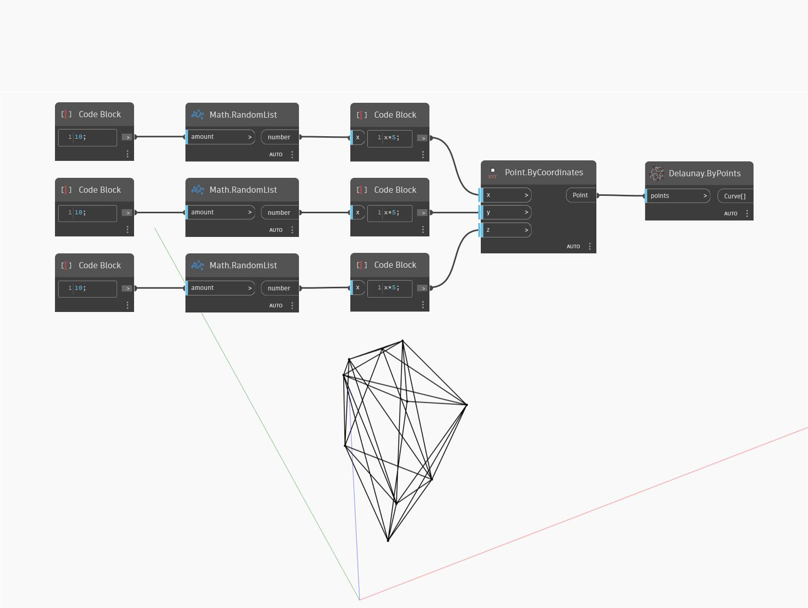

## En detalle:
`Delaunay.ByPoints` devuelve una lista de curvas que representan la triangulación de Delaunay de un conjunto de puntos.

En el ejemplo siguiente, una lista de puntos colocados aleatoriamente en 3D devuelve una lista de curvas que representan su triangulación de Delaunay.

___
## Archivo de ejemplo

