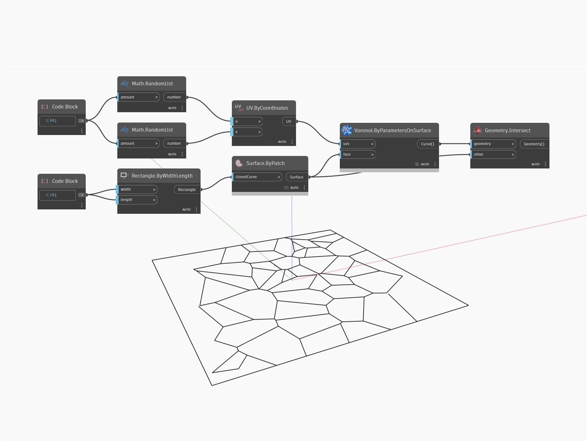

## En detalle:
ByParametersOnSurface devolverá una representación Voronoi del UV de una superficie como una lista de curvas. En el siguiente ejemplo, se crea una representación Voronoi en una superficie mediante un sistema UV de 50 valores aleatorios. Para que Voronoi se detenga en los bordes de la superficie, las curvas devueltas deben intersecarse con la superficie.
___
## Archivo de ejemplo

