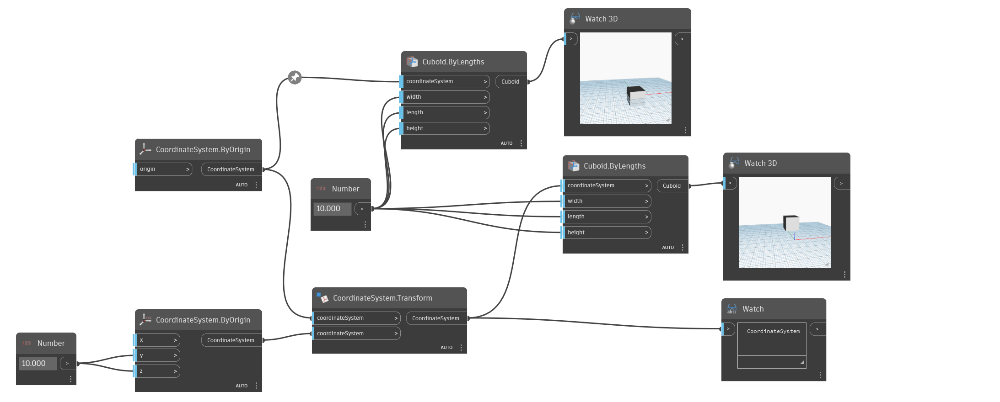

<!--- Autodesk.DesignScript.Geometry.CoordinateSystem.Transform(coordinateSystem, coordinateSystem) --->
<!--- U3C6XW5LVP2GS44OR67HZ43LHZHFNTYHMHG6X7YOGZMPS52CMXAA --->
## En detalle:
CoordinateSystem.Transform transformará el sistema de coordenadas especificado por otro.
___
## Archivo de ejemplo

