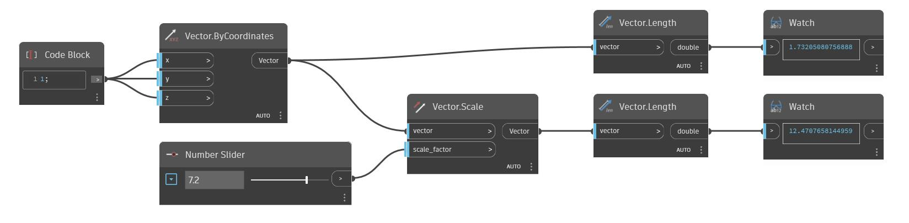

<!--- Autodesk.DesignScript.Geometry.Vector.Scale(scale_factor) --->
<!--- UNW3BJQZLUPQBNSPIOZP5QAFHL3GMBHAQBSV4IPTCMKOFUPI42NA --->
## En detalle:
Ajuste la escala del vector de manera uniforme alrededor del origen.
___
## Archivo de ejemplo

