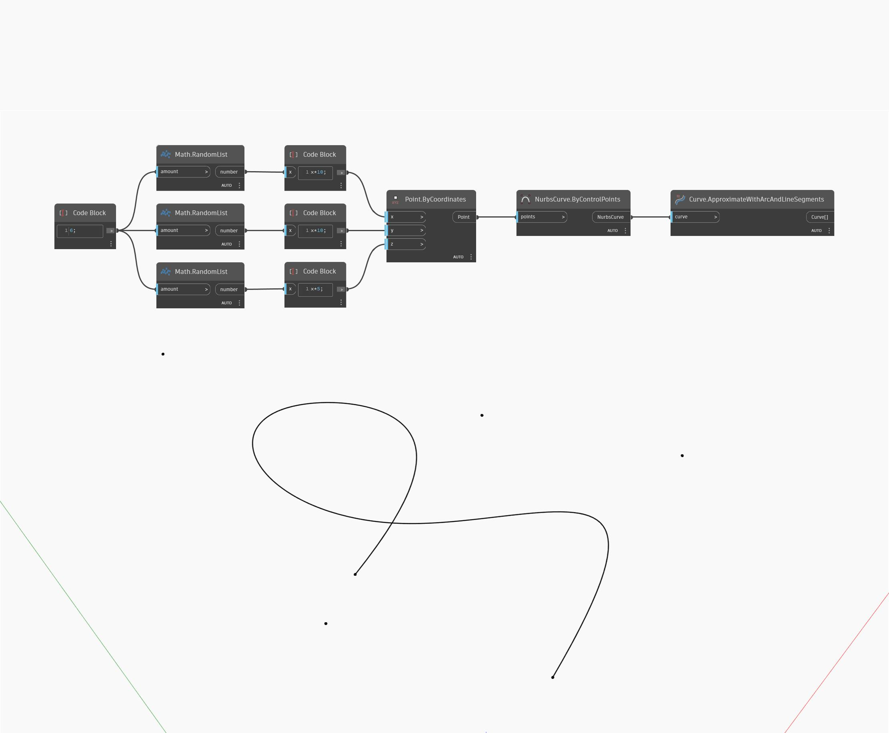

<!--- Autodesk.DesignScript.Geometry.Curve.ApproximateWithArcAndLineSegments --->
<!--- WCLH3WPRENEP5UME2OH55K7MQBNQV27U5PEFCF6YZBPO2CNXKJ2Q --->
## En detalle:
ApproximateWithArcAndLineSegments utiliza una curva como entrada y devuelve una lista de curvas de arco y línea recta que se aproximan a la curva original. En el siguiente ejemplo, se crea primero una curva NURBS mediante un nodo ByControlPoints con un conjunto de puntos generados aleatoriamente como entrada. A continuación, esta curva se utiliza como entrada para un nodo ApproximateWithArcAndLineSegments.
___
## Archivo de ejemplo

