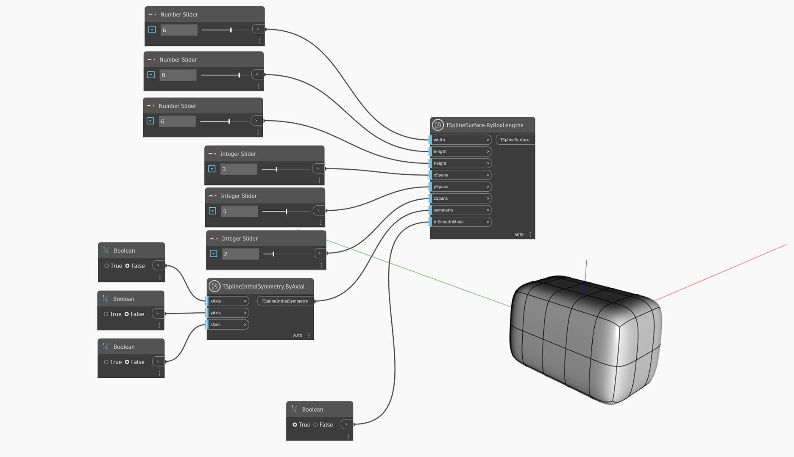

<!--- Autodesk.DesignScript.Geometry.TSpline.TSplineSurface.ByBoxLengths(width, length, height, xSpans, ySpans, zSpans, symmetry, inSmoothMode) --->
<!--- WN6BWNG6A6KOPFMMRBHLV7XBOOEGXTSO5I5FZXHKKUG5YO6MNNYA --->
## In-Depth
`TSplineSurface.ByBoxLengths(width, length, height, xSpans, ySpans, zSpans, symmetry, inSmoothMode)` crea una superficie de cuadro de T-Spline con dimensiones definidas por las entradas `width`, `length` y `height`, y el número de tramos X, Y y Z en cada dirección. El cuadro se centra alrededor del origen (0,0,0). Las opciones de simetría pueden especificarse con la entrada `symmetry`. La entrada booleana `inSmoothMode` alterna entre la vista preliminar de cuadro y suavizado.

## Archivo de ejemplo

