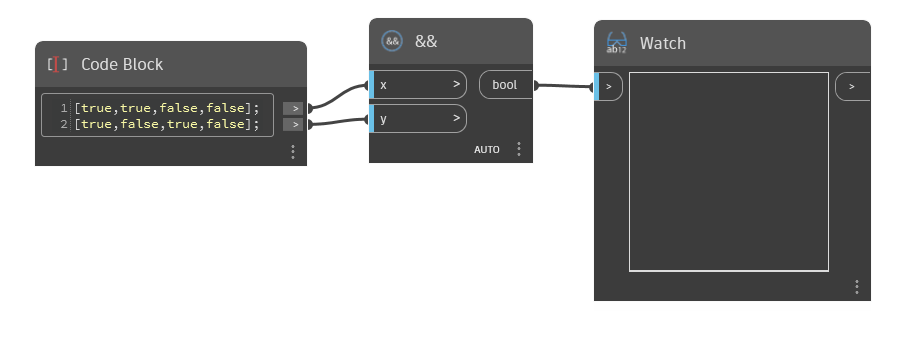

## Description approfondie
`&&` accepte deux valeurs booléennes ou listes de valeurs booléennes et détermine si les deux valeurs sont True. Dans tous les autres cas, il renvoie la valeur False.

Dans l'exemple ci-dessous, nous commençons par deux listes de valeurs booléennes. Ensemble, ces listes représentent les quatre combinaisons possibles de valeurs True et False. `&&` renvoie True uniquement pour la première paire de valeurs, qui sont toutes deux True. Les autres sont des combinaisons de True et False, ou False et False, donc `&&` renvoie False.
___
## Exemple de fichier

