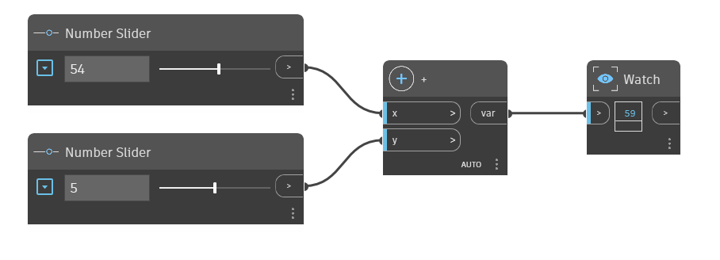

## Description approfondie
Le noeud "+" est l'opérateur d'addition. Il renvoie la somme des deux nombres d'entrée. Dans l'exemple ci-dessous, deux curseurs numériques sont utilisés pour contrôler les entrées de l'opérateur "+".
___
## Exemple de fichier

