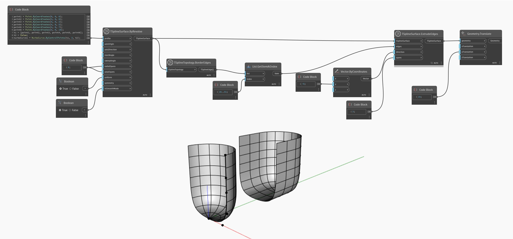

## Description approfondie
Dans l'exemple ci-dessous, un jeu d'arêtes de bordure d'une surface T-Spline est sélectionné et utilisé comme entrée pour le noeud `TSplineSurface.ExtrudeEdges`. Le résultat est converti sur le côté pour un meilleur aperçu.
___
## Exemple de fichier

