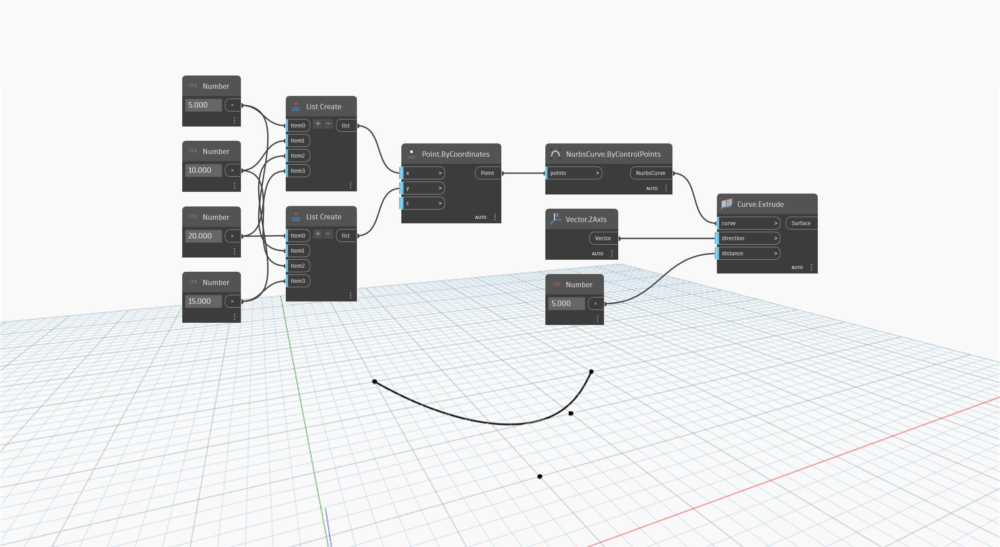

<!--- Autodesk.DesignScript.Geometry.Curve.Extrude(curve, direction, distance) --->
<!--- 5NB3FDYBJDTGURCB4X7W2I7P2TIGXAXPEUVWUMM2BTWHJ3GXRJQA --->
## Description approfondie
`Curve.Extrude (curve, direction, distance)` extrude une courbe d'entrée à l'aide d'un vecteur d'entrée pour déterminer la direction de l'extrusion. Une entrée `distance` distincte est utilisée pour la distance d'extrusion.

Dans l'exemple ci-dessous, nous créons d'abord une NurbsCurve à l'aide d'un noeud `NurbsCurve.ByControlPoints`, avec un ensemble de points générés de façon aléatoire comme entrée. Un Code Block est utilisé pour spécifier les composants X, Y et Z d'un noeud `Vector.ByCoordinates`. Ce vecteur est ensuite utilisé comme entrée de direction dans un noeud `Curve.Extrude`, tandis qu'un curseur numérique est utilisé pour contrôler l'entrée de la valeur `distance`.
___
## Exemple de fichier

