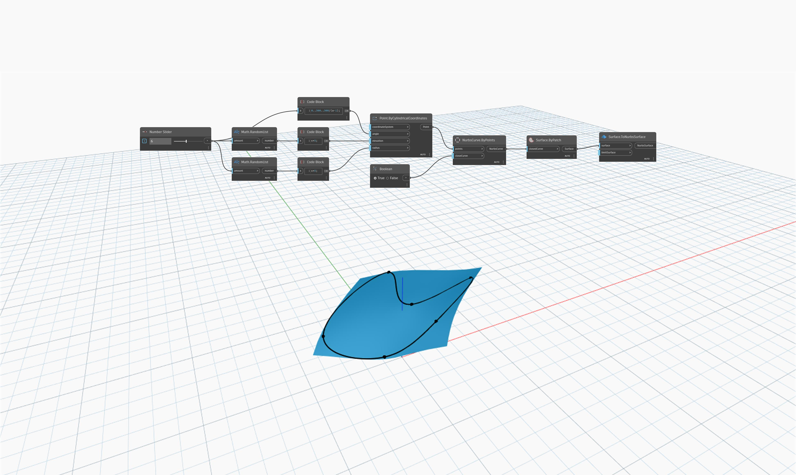

<!--- Autodesk.DesignScript.Geometry.Surface.ToNurbsSurface(surface, limitSurface) --->
<!--- 62R7TNV2KCZCI3DMDQF7KVWE5WHQRXUHIVL625TVQLCENC23EMBA --->
## Description approfondie
`Surface.ToNurbsSurface` prend une surface en entrée et renvoie une NurbsSurface qui se rapproche au mieux de la surface d'entrée. L'entrée `limitSurface` détermine si la surface doit être restaurée à sa plage de paramètres d'origine avant la conversion, par exemple, lorsque la plage de paramètres d'une surface est limitée après une opération d'ajustement.

Dans l'exemple ci-dessous, nous créons une surface à l'aide d'un noeud `Surface.ByPatch` avec une NurbsCurve fermée en entrée. Notez que lorsque nous utilisons cette surface comme entrée pour un noeud `Surface.ToNurbsSurface`, cela renvoie une NurbsSurface non ajustée à quatre côtés.

___
## Exemple de fichier

