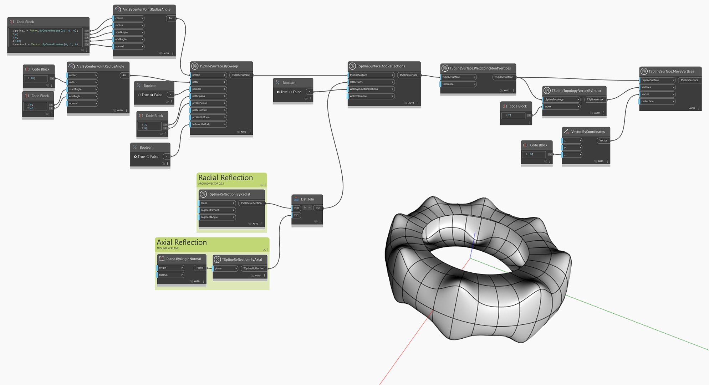

<!--- Autodesk.DesignScript.Geometry.TSpline.TSplineSurface.AddReflections --->
<!--- 6YGBDRGYLRW3BW4XJHLHBBRSCHYWA2UCJ5FQAESHDY2HMUBDUSLQ --->
## In-Depth
`TSplineSurface.AddReflections` crée une nouvelle surface T-Spline en appliquant une ou plusieurs réflexions à l'entrée `tSplineSurface`. L'entrée booléenne `weldSymmetricPortions` détermine si les arêtes pliées générées par la réflexion sont lissées ou conservées.

L'exemple ci-dessous illustre comment ajouter plusieurs réflexions à une surface de T-Spline en utilisant le noeud `TSplineSurface.AddReflections`. Deux réflexions sont créées - axiale et radiale. La géométrie de base est une surface de T-Spline en forme de balayage avec la trajectoire d'un arc. Les deux réflexions sont jointes dans une liste et utilisées comme entrée pour le noeud `TSplineSurface.AddReflections, avec la géométrie de base à refléter. Les surfaces de T-Spline sont soudées, ce qui crée une surface de T-Spline lisse sans arêtes pliées. La surface est modifiée en déplaçant un sommet à l'aide du noeud `TSplineSurface.MoveVertex`. En raison de la réflexion appliquée à la surface de T-Spline, le mouvement du sommet est reproduit 16 fois.

## Exemple de fichier

