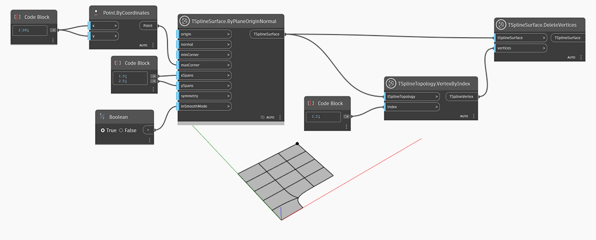

<!--- Autodesk.DesignScript.Geometry.TSpline.TSplineSurface.DeleteVertices --->
<!--- 76IVI422OMRMPHCWZHTETSZ3PJF22AOV2AX274LZCNLPCK664PGQ --->
## Description approfondie
Dans l'exemple ci-dessous, une surface de T-Spline primitive de plan est créée à l'aide d'un noeud `TSplineSurface.ByPlaneOriginNormal`. Un ensemble de sommets est sélectionné à l'aide du noeud `TSplineTopology.VertexByIndex` et fourni comme entrée dans le noeud `TSplineSurface.DeleteVertices`. Par conséquent, toutes les arêtes se joignant au sommet sélectionné sont également supprimées.

## Exemple de fichier

