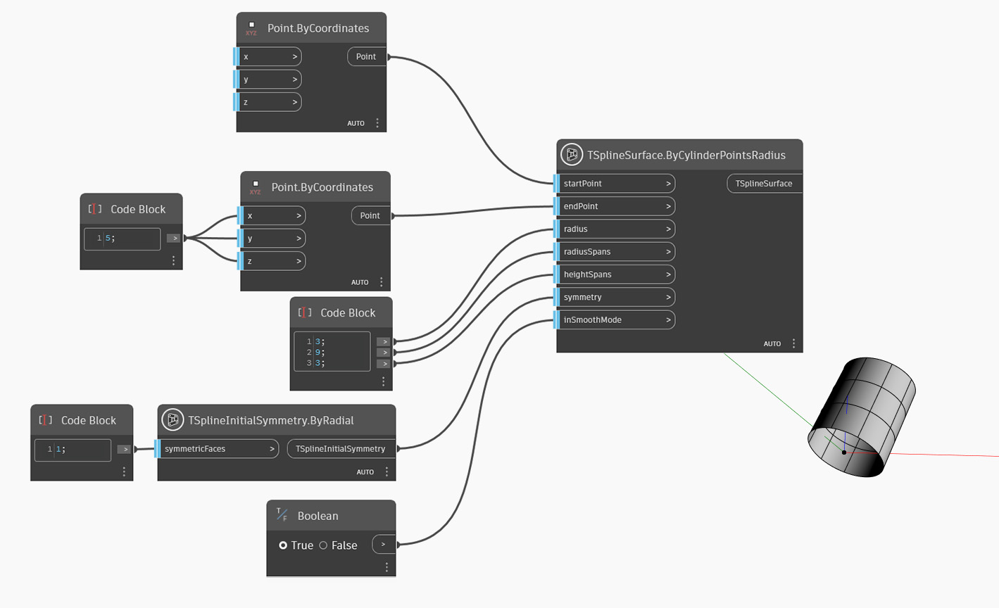

<!--- Autodesk.DesignScript.Geometry.TSpline.TSplineSurface.ByCylinderPointsRadius --->
<!--- AUSALFCUDD62GV5ALRNIDJ43LBF3FWW5HY5WNAQBKRB7E2JF7WUQ --->
## In-Depth
Dans l'exemple ci-dessous, une surface de cylindre de primitive de T-Spline est créée. Les plans inférieur et supérieur du cylindre sont définis par les entrées `startPoint` et `endPoint` et la taille est définie par la valeur d'entrée `radius`. Les segments dans les directions radiale et de hauteur sont contrôlés par les entrées `radiusSpans` et `heightSpans`. La symétrie initiale de la forme est spécifiée par l'entrée `symmetry`. Si la symétrie X ou Y est définie sur True, la valeur des segments radiaux doit être un multiple de 4. Enfin, l'entrée `inSmoothMode` est utilisée pour basculer entre l'aperçu en mode lisse et en mode boîte de la surface de T-Spline.

## Exemple de fichier

