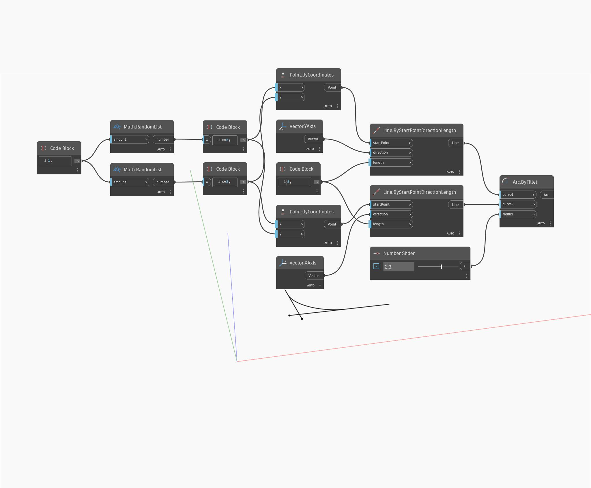

## Description approfondie
Arc ByFillet dessine une partie d'un cercle tangentiel le long de deux courbes d'entrée. Dans cet exemple, deux lignes sécantes sont dessinées, puis raccordées selon un rayon contrôlé.
___
## Exemple de fichier

