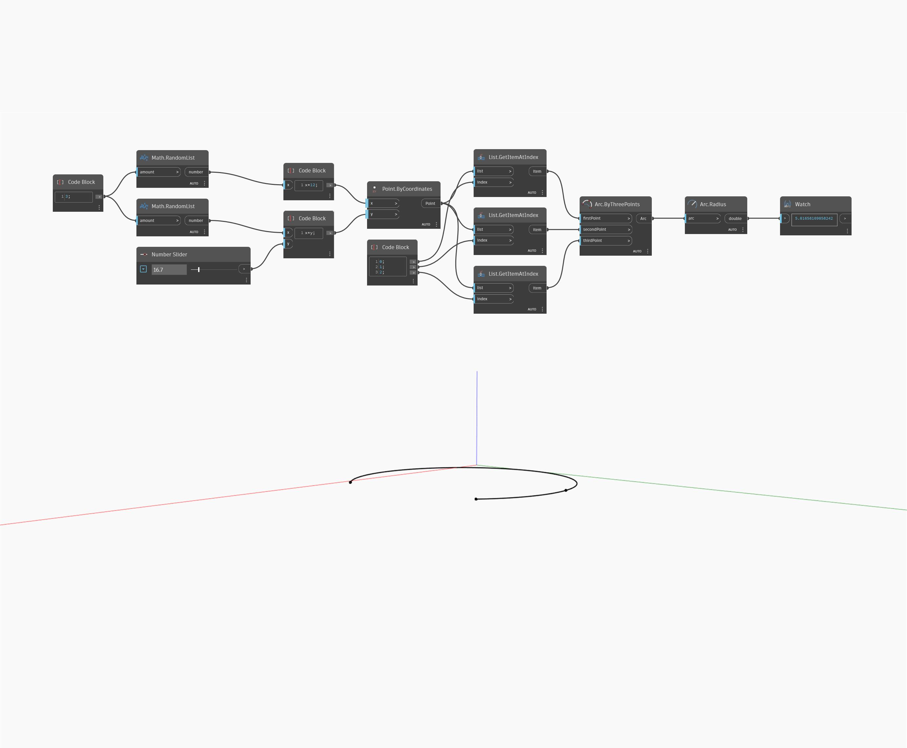

## Description approfondie
`Arc.Radius` renvoie la valeur du rayon de la géométrie de l'arc.

Dans l'exemple ci-dessous, nous créons un arc à partir de 3 points générés de façon aléatoire, puis nous renvoyons son point de rayon à l'aide d'un noeud `Arc.Radius`. Nous pouvons visualiser le changement de rayon lorsque les points d'entrée changent dans la direction Y.

___
## Exemple de fichier

