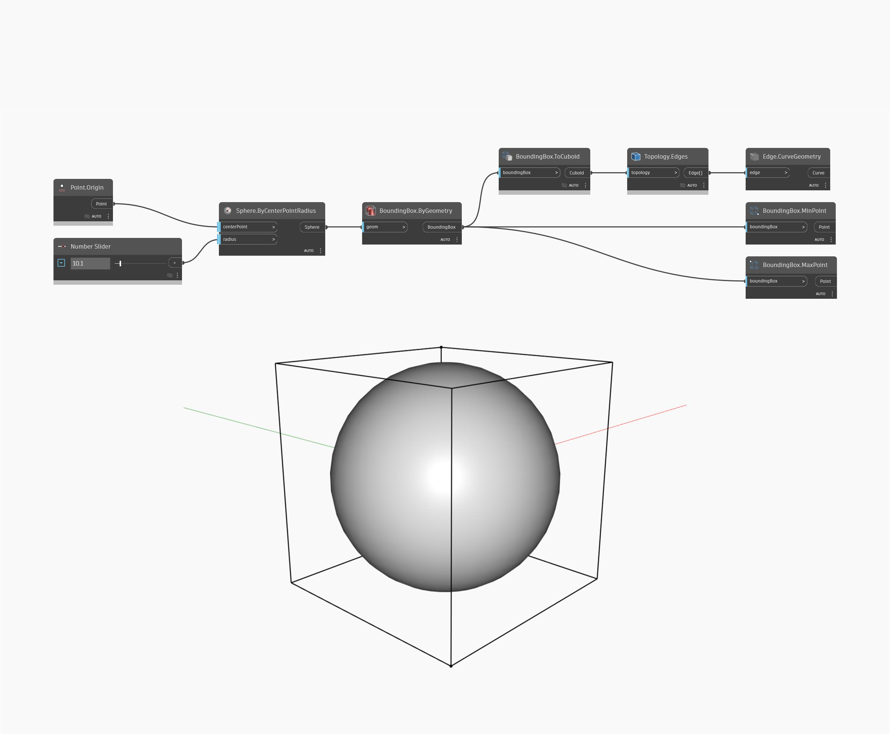

## Description approfondie
BoundingBox ToCuboid crée une géométrie cuboïde à partir d'une boîte englobante. Pour visualiser la relation entre la sphère d'entrée et le cuboïde dans l'exemple, nous extrayons ses courbes d'arête.
___
## Exemple de fichier

