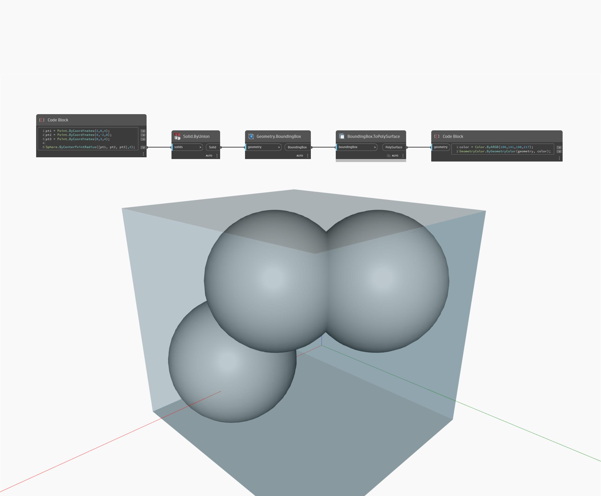

## Description approfondie
ToPolySurface renvoie une boîte englobante sous forme de PolySurface. Dans l'exemple ci-dessous, la boîte englobante de plusieurs sphères unifiées est renvoyée sous forme de PolySurface. La PolySurface obtenue s'affiche en couleur et en transparence pour montrer la géométrie d'origine à l'intérieur.
___
## Exemple de fichier

