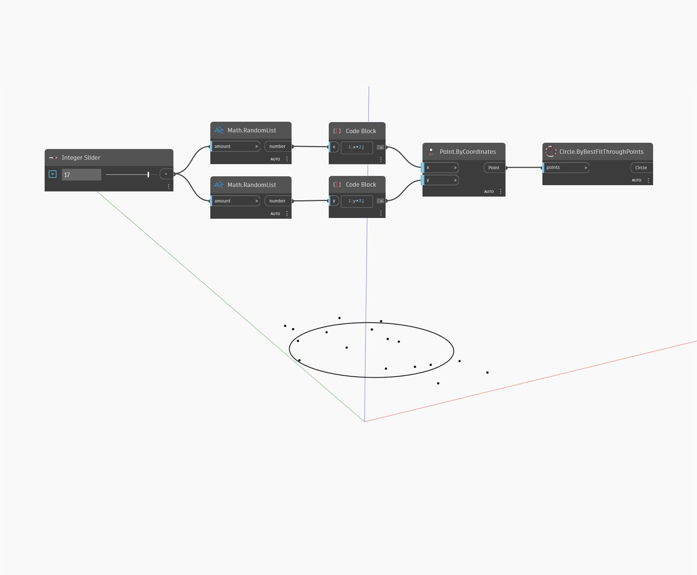

## Description approfondie
`Circle.ByBestFitThroughPoints` reçoit des entrées de point et crée un cercle ajusté au mieux à travers ceux-ci.

Dans l'exemple ci-dessous, une liste de points générés de façon aléatoire est utilisée pour générer un cercle qui s'en rapproche le plus. Vous pouvez augmenter et diminuer le nombre de points de manière dynamique à l'aide d'un curseur numérique, ce qui modifie la forme du cercle ajusté au mieux.

___
## Exemple de fichier

