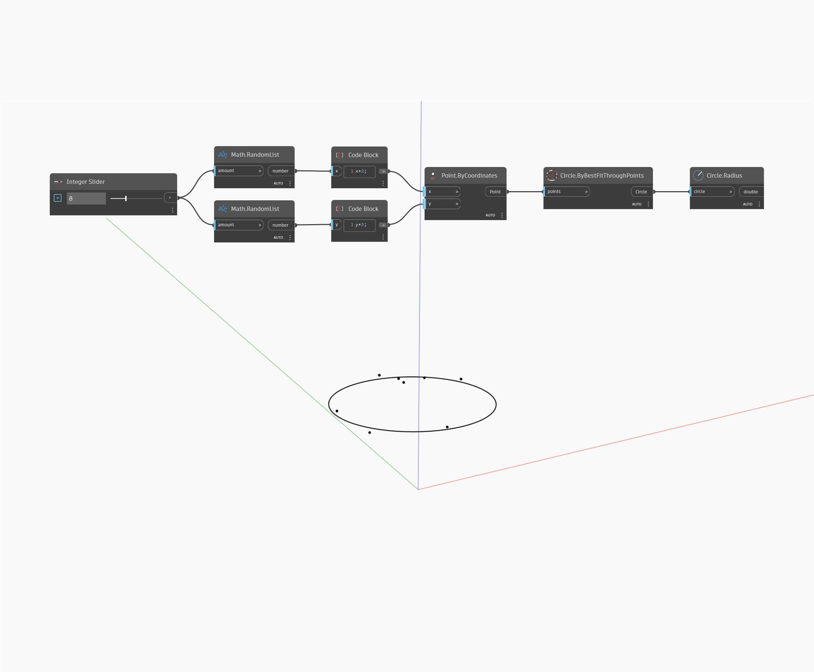

## Description approfondie
`Circle.Radius` trouve le rayon d'un cercle donné.

Dans l'exemple ci-dessous, nous créons un cercle à l'aide du noeud `Circle.ByBestFitThroughPoints`, puis nous extrayons le rayon du cercle.

___
## Exemple de fichier

