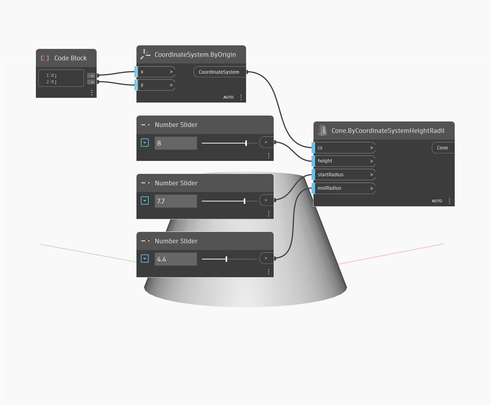

## Description approfondie
Cone ByCoordinateSystemHeightRadii crée une géométrie de cône tronquée à partir de deux rayons, de l'origine de départ et une valeur de hauteur. Cet exemple montre un cône dynamique autour de l'origine du SGD, construit avec trois curseurs numériques.
___
## Exemple de fichier

