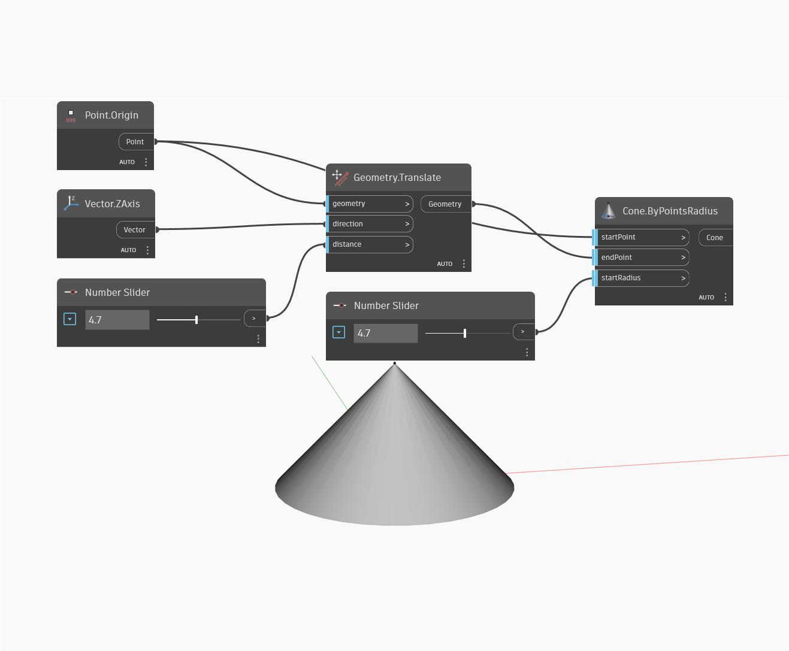

## Description approfondie
`Cone.ByPointsRadius` crée une géométrie de cône à partir d'un point de départ, d'un point d'arrivée et d'une valeur de rayon.

Dans l'exemple ci-dessous, un cône dynamique autour de l'origine universelle est construit à l'aide de deux curseurs numériques qui contrôlent la hauteur et le rayon du cône.

___
## Exemple de fichier

