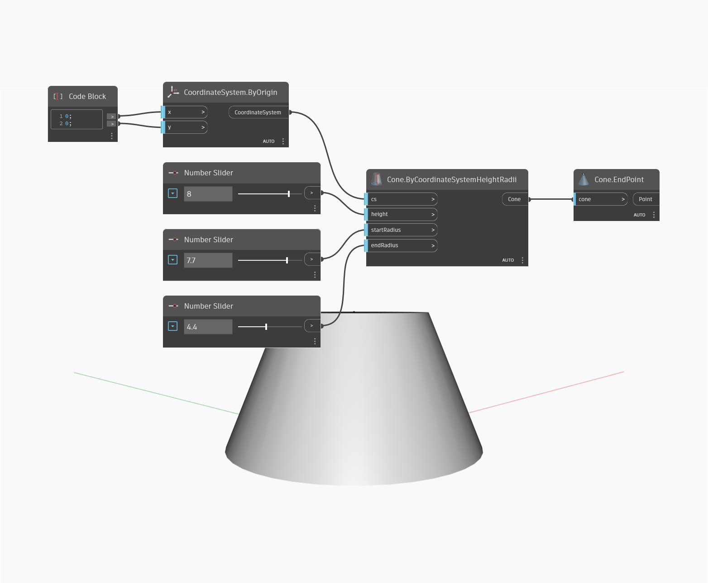

## Description approfondie
`Cone.EndPoint` renvoie le sommet d'un cône ou le centre du cercle supérieur d'un cône tronqué.

Dans l'exemple ci-dessous, nous créons un cône en spécifiant un système de coordonnées et deux rayons. Nous utilisons ensuite le noeud `Cone.EndPoint` pour trouver le centre du cercle supérieur du cône.

___
## Exemple de fichier

