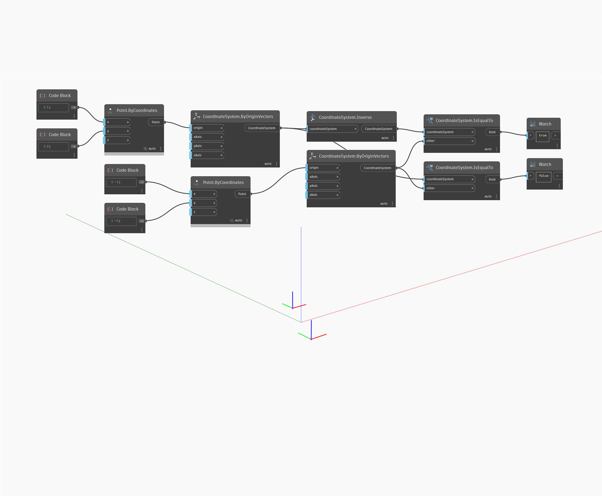

## Description approfondie
Inverse renvoie un CoordinateSystem inversé à partir de l'entrée. Dans l'exemple ci-dessous, un CoordinateSystem à (1,2,0) est inversé dans un CoordinateSystem à (-1,-2,0). La géométrie dessinée sur les CoordinateSystems sera opposée à l'origine du SCG les unes par rapport aux autres.
___
## Exemple de fichier

